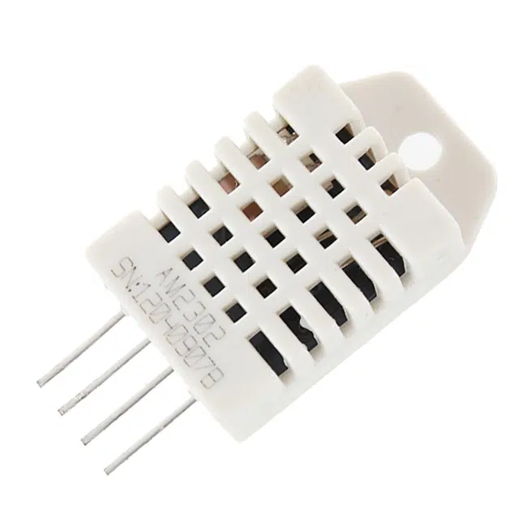

# Sensor DHT22 – Temperatura e Umidade

<p align="center">
  
</p>


## Visão Geral
O DHT22 é um sensor digital de temperatura e umidade amplamente utilizado em aplicações IoT devido à sua precisão e estabilidade. No **Projeto CasaViva**, ele fornece dados ambientais em tempo real para análise, visualização no LCD e publicação via MQTT.

## Especificações Técnicas
| Propriedade           | Valor                           |
|-----------------------|---------------------------------|
| Faixa de Temperatura  | -40°C a +80°C                    |
| Precisão (Temp)       | ±0.5°C                           |
| Faixa de Umidade      | 0% a 100% RH                     |
| Precisão (Umidade)    | ±2% RH                           |
| Tensão de Operação    | 3.3V ou 5V (usando Wokwi: 3.3V)  |
| Interface             | Digital (1 fio)                  |

## Pinagem
| Pino | Função                |
|------|------------------------|
| 1    | VCC (3.3V)            |
| 2    | DATA (esp32 GPIO4)    |
| 3    | NC (não conectado)    |
| 4    | GND                   |

## Uso no Projeto
- Medição contínua de temperatura e umidade.
- Exibição das métricas no LCD (página principal).
- Cálculo de máximos e mínimos.
- Envio via MQTT.
- Identificação de falhas (quando `isnan()` retorna verdadeiro).

## Código Referência
```
DHT dht(4, DHT22);
float t = dht.readTemperature();
float h = dht.readHumidity();
```