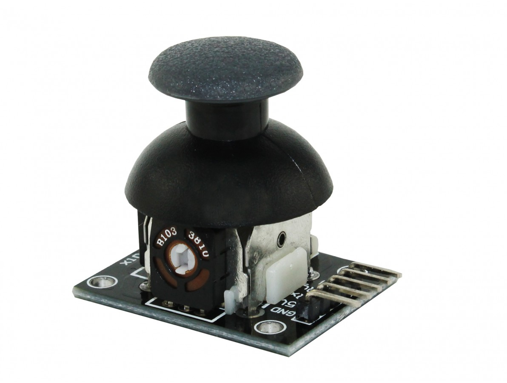

# Joystick Analógico – Controle do Sistema

<p align="center">
  
</p>

## Descrição
  Joystick de dois eixos usado como interface para navegação do LCD e modos do sistema.

## Mapeamento
| Eixo | Função |
|------|--------|
| HORZ | Troca de páginas |
| VERT | Atualizar sensores / congelar LCD |
| SEL  | Liga/Desliga modo ECO |

## Pinagem
| Pino     | ESP32 |
|----------|--------|
| HORZ     | GPIO 35 |
| VERT     | GPIO 32 |
| Button   | GPIO 14 |
| VCC      | 3.3V |
| GND      | GND |

## Código
```
int x = analogRead(35);
int y = analogRead(32);
```