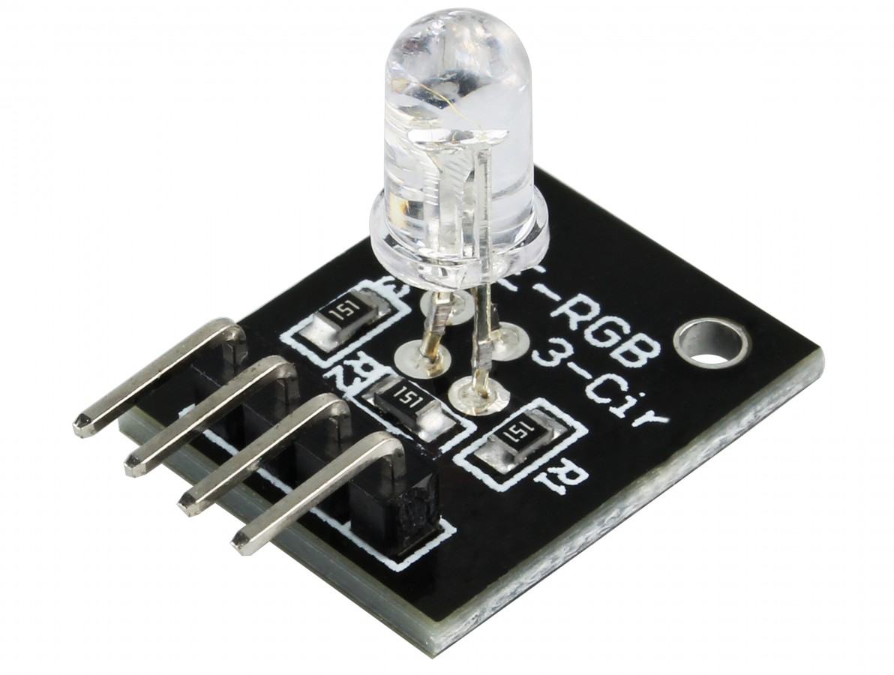

# LED RGB – Indicador de Status Ambiental

<p align="center">
  
</p>

## Funções
- Verde → ar saudável
- Amarelo → atenção
- Vermelho → alerta de poluição
- Azul → alerta de ruído

## Pinagem
| Cor | ESP32 | Resistor |
|------|--------|-----------|
| R    | D2     | 220Ω |
| G    | D26    | 220Ω |
| B    | D5     | 220Ω |
| COM  | GND    | — |

## Código Referência
```
analogWrite(26, valorVerde);
```